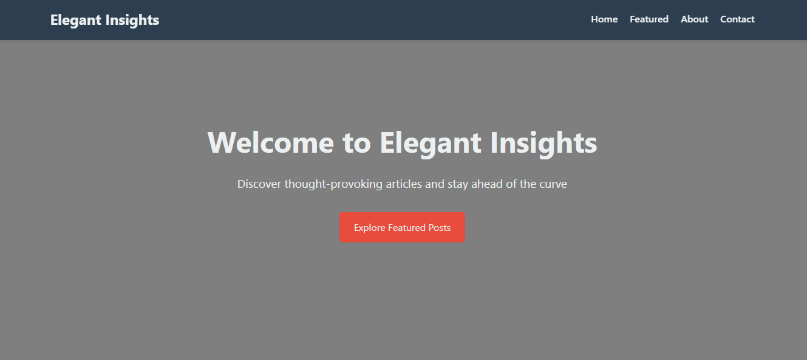
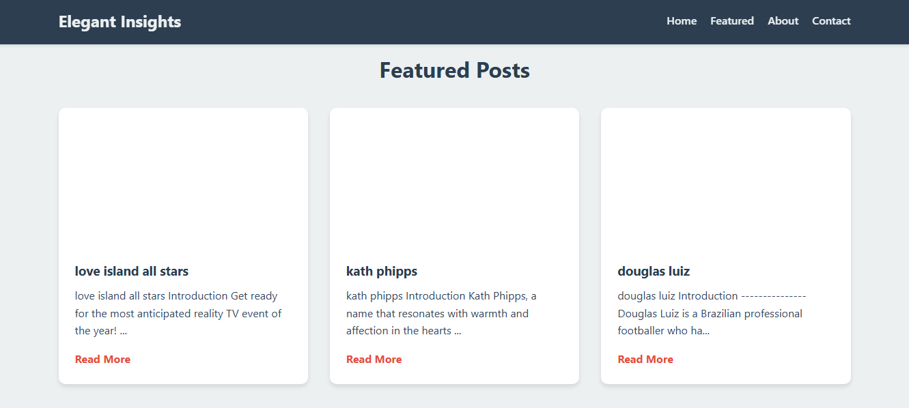

# AI-Powered News Portal

Built on Django and powered by AI, this News Portal creates live news articles on trending topics. It can be extended to create a whole AI-powered news platform, fetching live data from Google Trends.

## Table of Contents
- [Purpose](#purpose)
- [Information](#information)
- [Usage](#usage)
- [Setup](#setup)
- [Screenshots](#screenshots)
- [Future Changelogs](#future-changelogs)
- [License](#license)
- [Contributing](#contributing)
- [Contact](#contact)

## Purpose
The AI-Powered News Portal is designed to provide up-to-date news articles on trending topics. It leverages AI to automate the process of news creation, ensuring that users receive the latest information in real-time.

## Information
This project is built using Django, a high-level Python web framework that encourages rapid development and clean, pragmatic design. The AI component is integrated to analyze trends and generate relevant news articles.

## Usage
To use the News Portal, simply navigate to the homepage where you'll find the latest articles on trending topics. The portal automatically updates with new content as trends evolve.

## Setup
To set up the project locally, follow these steps:

1. Clone the repository:
   ```bash
   git clone https://github.com/AstonWilliams/AI_NEWS_PORTAL.git
   ```

2. Navigate to the project directory:
   ```bash
   cd AI_NEWS_PORTAL
   ```

3. Create a virtual environment:
   ```bash
   python -m venv env
   ```

4. Activate the virtual environment:
   - On Windows:
     ```bash
     .\env\Scripts\activate
     ```
   - On macOS/Linux:
     ```bash
     source env/bin/activate
     ```

5. Install the required dependencies:
   ```bash
   pip install -r requirements.txt
   ```

6. Apply migrations:
   ```bash
   python manage.py migrate
   ```

7. Make migrations:
   ```bash
   python manage.py makemigrations
   ```

8. Run the development server:
   ```bash
   python manage.py runserver
   ```

9. Open your web browser and navigate to `http://127.0.0.1:8000/` to view the News Portal.

10.Or you can serve the application on your local network
check the ip address of the wifi/ethernet/bluetooth etc interface
```bash
ipconfig
```
Serve the Django application using this example command
   ```bash
   python manage.py runserver 192.168.48.169:80
   ```


## Screenshots

### Home Page


### Articles


### Article Page


## Future Changelogs
- 🎯 **Version 1.1.0**: Optimize AI responses for accurate markdown rendering and link formatting.
- 🎯 **Version 1.1.0**: Integrate intelligent image and media scraping for enhanced article referencing.
- 🎯 **Version 1.1.1**: Deploy advanced AI algorithms to improve trend analysis precision.
- 🎯 **Version 1.2.0**: Develop an automated mechanism for creating datasets to train deep learning models for fact-checking, news hosting, and news generation.
- 🎯 **Version 2.0.0**: Introduce multimedia content including videos and podcasts to diversify news delivery.
- 🎯 **Version 2.1.1**: Transition the website to production level and incorporate additional AI-powered features.
- 🎯 **Version 2.1.2**: Automate and streamline data flow to ensure independent and efficient operations.

## License
This project is licensed under the MIT License - see the [LICENSE](LICENSE) file for details.

## Contributing
Contributions are welcome! Please read the [CONTRIBUTING](CONTRIBUTING.md) guidelines before submitting a pull request.

## Contact
If you have any questions, feel free to contact me at [developer's mail](mailto:a91060705@gmail.com).
